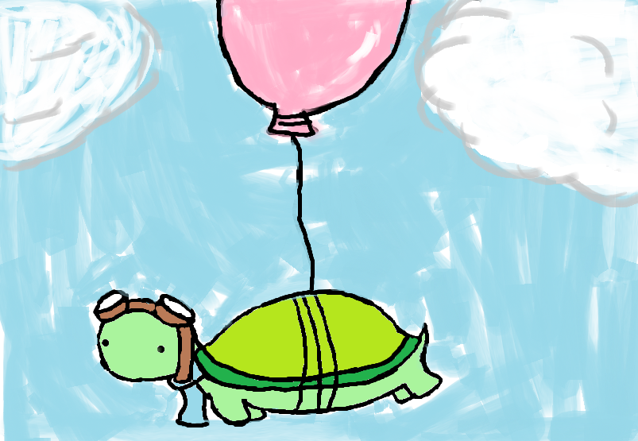

<h2> A Rising Star </h2>
My coding and programming experience began in my freshman year of high school in my STEM course that they had luckily provided. I originally signed up for the wrong class and had to transfer into my STEM course at the time which was full, however, the teacher had given me an exception to join the class. This is where my journey begins as a CS student.

The very first coding experience I had was with HTML and CSS, having to make my own front end of my first website which was exciting to do since I realized that this is what people actually have to do in the real world. The experience gained from the very first class really caught my eye into the world of computer science and the practicality of it all. Throughout the very first year, I also had a short encounter with JavaScript which showed us how to provide more functionality to our websites.

For the rest of my high school STEM course career, we jumped along from learning HTML, CSS, and JavaScript to other languages such as Python, PHP and even learned how to use the MySQL database as well as how to use the command line to navigate through our operating system. 

<h2> Time Flies </h2>
All though everything seemed very slow throughout the years, collectively, I have learned so much and moved so far ahead of where I thought I would be today. In a way, all that has happened throughout school for me is analogous to the tortoise in the race with the hare. As long as I move at my own pace and gain something valuable along the way, I will win this race. 

The skills I hope to gain over the next few years would really be to collaborate with others since, in the typical school setting that I have been in for the majority of my life, it was mostly a single-player game. No collaboration insight, if it was, then it would be considered cheating or unacceptable. Of course, learning new languages and frameworks is also a must. 

<h2> What Lies in the Middle </h2>
My interests over the years have been focused on the different aspects of computer science as well as financial topics such as stocks and investing. This ultimately led me to combine both aspects of computer science and stocks to see that somewhere in the middle lies cryptocurrency which is a hot topic nowadays. The blockchain technology that goes into making a cryptocurrency intrigues me and I want to learn more about it. 
