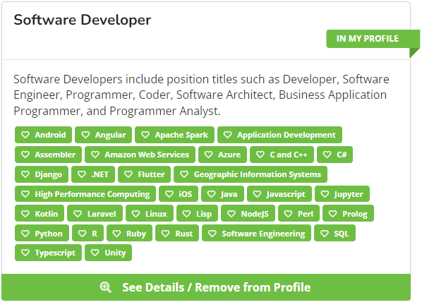

## A Familiar Setting
As new of an experience RadGrad is for me, many of the features seen in this great platform have already been implemented into my life as a CS student here at UH Manoa. The degree planner is one of the things that I have been using prior to RadGrad which is an excellent way of keeping me on track to finishing my degree and getting the career I strive for. There are also tons of career options to browse through here, and it does seem overwhelming at times to pick and choose what I may want to do in the future, but that is what college is all about. Experimenting and trying new things to figure out what I want in life. I have seen many of the presented opportunities, careers, and interests, however, I still do not know what I may want to pursue on this current track. 

## Nothing is Set in Stone
Although I am a highly goal-oriented person, that does not mean that I have a clear-cut route to achieving my goals. As of now, my short/mid-term goal is to finish this degree with the ultimate goal of landing a great and stable job in the field of software engineering after college. RadGrad has shown me how diverse the career pool is for a CS major, and that is troubling for me because I am indecisive and do not know which to pick. I think this may be because I am still a second year in the program without much experience or courses under my belt just yet. One of the many things I hope to gain from RadGrad and college is the experience needed to determine what I want with this degree. 

## RadGrad Worth It?
I believe that RadGrad is a great platform to buckle down on what you have to do to achieve your goals no matter what it may be pertaining to the ICS curriculum. Although I cannot speak for everyone on this, I do think that RadGrad’s ability to improve our degree experience is beneficial, but also subjective. From personal experience in this degree as of now, I do not think RadGrad will be that beneficial for me in terms of further academic and career development because I already have a small idea of what I want. Though it is not fully clear what that may be, I was already exposed to most of the opportunities and careers present in RadGrad, so that is just my opinion of my own journey as of far. 

In my opinion, someone in this degree path without any knowledge of what careers or opportunities are present will immensely benefit from using RadGrad. 

## Ninja 
With all that said, even though I do not personally think RadGrad will be as beneficial for me, it does not hurt to consistently use the platform for personal use. I do hope to ultimately reach the ninja level black badge as a little trophy to myself that I was able to reach this moment. If I am able to reach ninja-level status, then I know for sure that I will be ready for whatever comes my path.  

