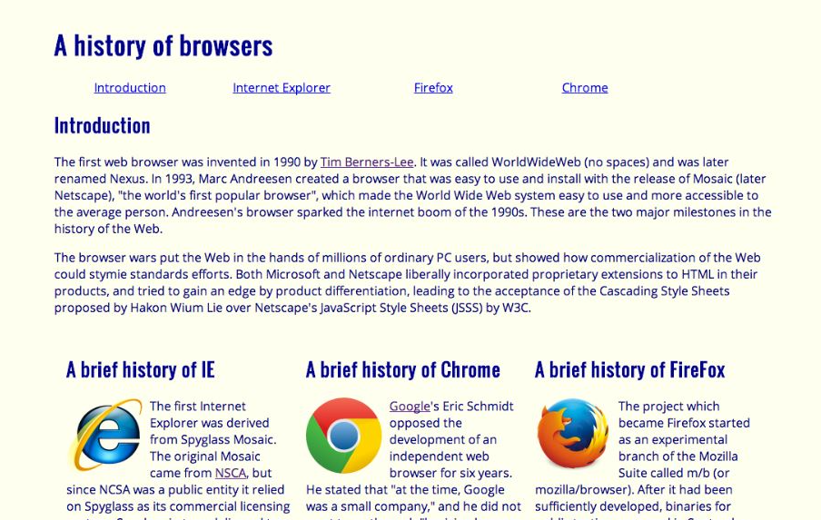
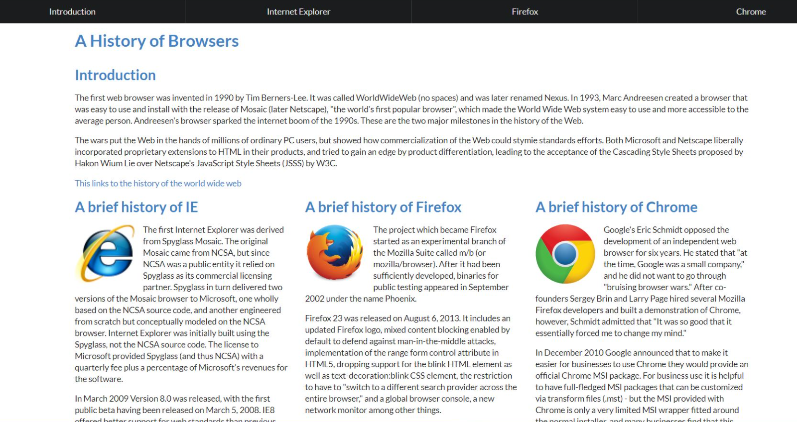

## My Very First Framework

Prior to taking Software Engineering (ICS 314), I have never incorporated a UI framework such as Semantic UI. It really is eye-opening to realize that most, if not all the things that I have made in HTML and CSS can be easily done with a few framework class calls. The simplicity and convenient design of a well-made framework can speed up the process of making just about anything I want. I really can start off by saying that Semantic UI is awesome! 

## Semantic VS Raw HTML/CSS

So, what's the difference between a website incorporating a UI framework compared to a website using just raw HTML and CSS? The result is almost day and night.

