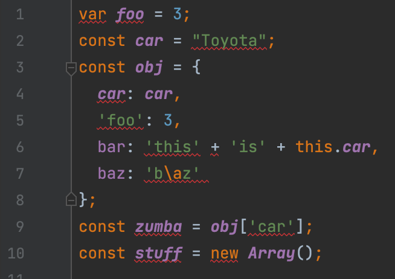
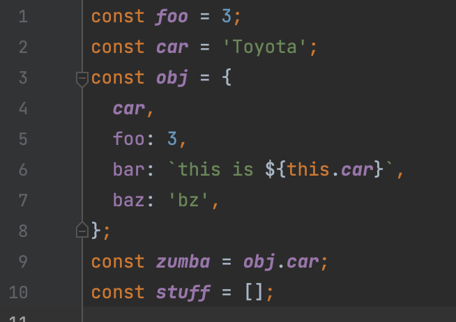

## My Standards
Prior to experiencing my first coding experience in ICS 111, there was no clear cut coding standard such as codestyle in Java or ESLint in Javascript. I was just  writing code based on what I deemed looked acceptable and nice. For me, this meant spaces after every comma, comparator operation, etc. Of course this was not a reliable method of coding because of the common mistakes that I made from doing what I deemed acceptable. With the introduction of coding standards in ICS 111 and now ICS 314, it has made the process of keeping my code clean much easier. 

## Your Standards
Everyone has their own style of writing code and their own personal machine and work environment, so it may seem difficult to standardize people’s work and mold it into one cohesive product in the end. ESLint allows us to standardize everyone’s style of code without extra thought. The process of distributing a shared coding standard through IntelliJ’s preferences is extremely easy to implement into everyone’s project. By having the same environment everyone works in, we are prone to have less problems and are easily able to point out any potential problems that may arise just because everyone is working with the same set of tools. 

## Am I to Blame?
I’ve seen some really bad looking code in my time that does not adhere to coding style standards. This made helping out peers much more difficult because I could not point out many errors due to the lack of spacing between comparisons, or perhaps they made a function all in one line without proper spacing which made the debugging process a hassle due to the many overlaps of opening and closing braces. 

I remember helping out a peer on their debugging process and did not want to say that they should be spacing their code correctly just so their work did not look like spaghetti. I did not want to offend them by telling them to space their work every other line, ESLint does this for me without having to tell them myself which is the best part. I am not to blame for the red squiggly lines under the code! 

## Love / Hate Relationship
At times I feel that ESLint does slow me down when in the process of problem solving, and one way I avoid being slowed down is by solving the problem first, ignoring the coding standards, then going back and fixing all the errors I have made. This is probably bad practice but I live and I learn. I think the best way to overcome this is probably to just force myself to code in code style standard, that way, I don't have to worry about it in the end.

In the long run, I know that adhering to the code standard is not just beneficial for me, but it is highly beneficial for others that may be working on the same project that I am. The legibility that comes from code standards saves tons of time, rather than scouring through a pile of work, we are able to identify problems faster to efficiently manage our time working on whatever it may be. I do have to say that fixing the final line of ESLint error, changing the top right from a red error sight to a green checkmark is a nice thing to see at the end of a project. 
