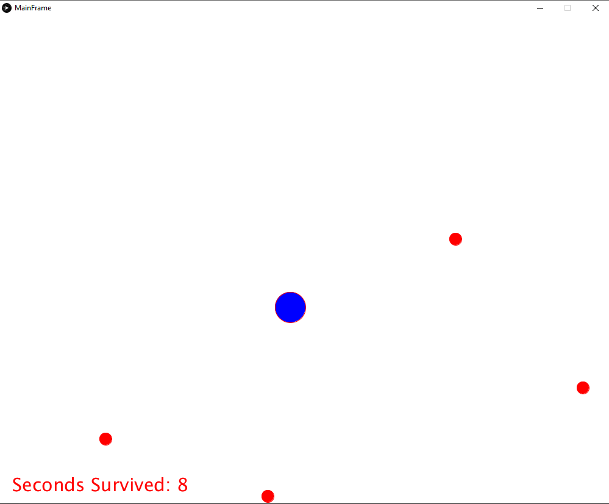
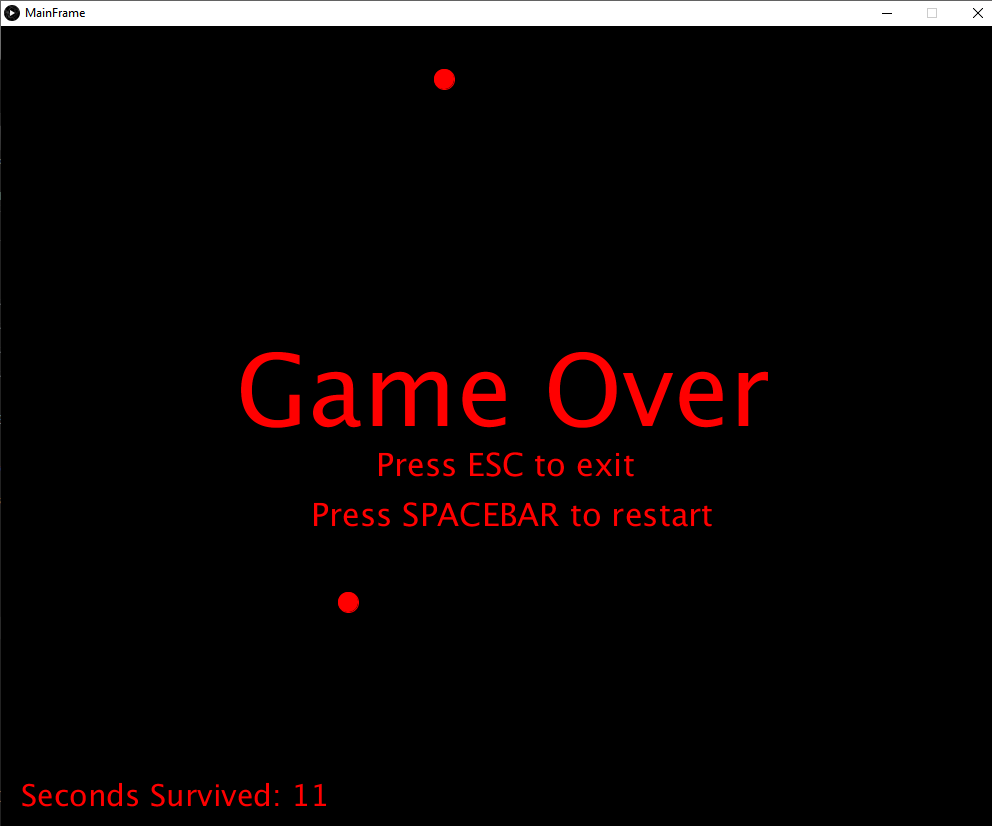

  
  

This is a simple dodging game where you play as a blue dot dodging smaller red dots coming from all different sides of the game board. The goal is to live as long as you can without getting hit by the incoming projectiles. 

I was the sole maker of the code for the game, it incorporates coding with Java as well as a program called Processing which is a software sketchbook which really streamlined the process of making the GUI and interface for the game. Taking in keyboard input was done through built in function of the Processing software which helped make the character move. The experience I gained from the game is immense, from simple physics concepts of speed and movement, to learning how to capture user input through their keyboard and output something visual i.e. having the main character (blue dot) move on screen in real time. 

Source: <a href="https://github.com/William-Liang808/Circle-Dodge-Game"><i class="large github icon "></i>William-Liang808/Circle-Dodge-Game </a>
Learn more about Processing: <a href"https://processing.org/">Processing</a>

