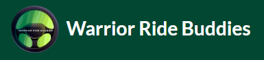

The goal of this project was to connect riders with drivers in the UH community to commute to UH Manoa together. With recent events, the cost of gas has skyrocketed and we thought this would help ease the cost of commuting for all.

Warrior Ride Buddies is an amazing web application and I and four others, have worked on tirelessly throughout the latter half of the spring 2022 semester. The web application allows users to use the Google Map's API service to pinpoint their location and display on a public map with our database. This is what will bring students and faculty together. As a user you are able to message any other user nearby to connect and hopefully set up plans together to commute to UH Manoa. 

You are able to add trips to and from UH Manoa depending on day, time, arrival, and departure. One of the many great features we have incorporated include a well designed filter that sorts through the user database and displays users on the map depending on the given specifications i.e. filtering the map of users by time of arrival or departure. 

Through out the course of this project, I had gravitated towards doing UI work for the project as well as creating tests to assure that the web application is working as expected.

You can learn more at <a href="https://warrior-ride-buddies.github.io/">warrior-ride-buddies.github.io</a>
